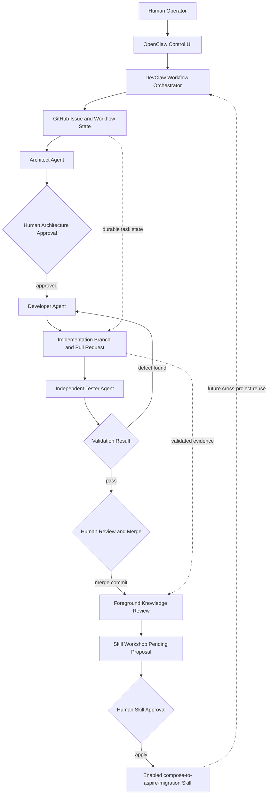
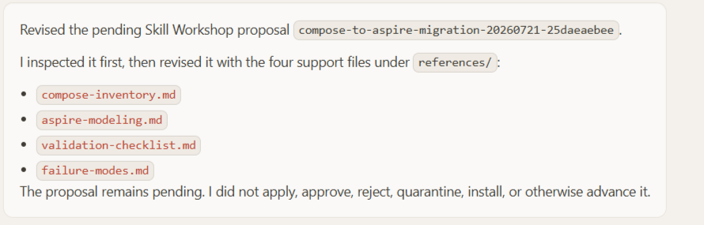
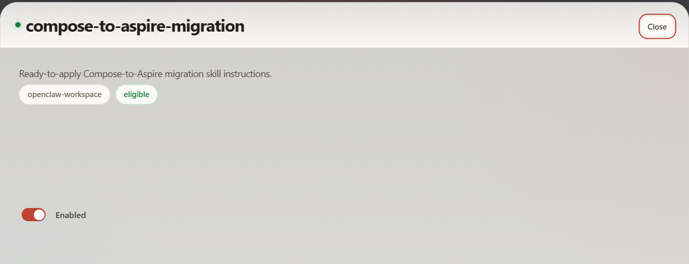

# Governed Multi-Agent Compose-to-Aspire Migration

Experiment 06 - Google Cloud Online Boutique

## Overview

Experiment 06 validated a governed multi-agent workflow for migrating a local Docker Compose application baseline to .NET Aspire. The work was performed in [Application Modernization Lab](https://github.com/DimitryZH/application-modernization-lab) against the [Experiment 06 directory](https://github.com/DimitryZH/application-modernization-lab/tree/main/experiments/06-online-boutique).

The migration used [issue #5](https://github.com/DimitryZH/application-modernization-lab/issues/5) as durable task state, [implementation PR #6](https://github.com/DimitryZH/application-modernization-lab/pull/6) for the Aspire migration, and [closeout PR #7](https://github.com/DimitryZH/application-modernization-lab/pull/7) for repository documentation.

## Engineering Challenge

Google Cloud Online Boutique is a polyglot microservices application originally oriented around Kubernetes and Skaffold. The experiment first used a validated Docker Compose baseline as the local reference, then represented the same required runtime topology with a .NET Aspire AppHost while preserving local functional behavior.

The original Online Boutique service implementations were not modified. Experiment 06 added an Aspire AppHost, validation script and evidence, and documentation assets.

## Platform Components

- OpenClaw provided the operator-facing control surface and agent runtime.
- DevClaw provided workflow orchestration, role dispatch, task state, and review-state transitions.
- A controlled Agent DevBox provided the Linux execution environment.
- GitHub issues, labels, comments, branches, and pull requests provided durable delivery state.
- OpenAI-backed role sessions performed architecture, development, and testing work under explicit human review.

## Governed Workflow

## Architecture Review and Human Approval

The architect role inspected the validated Compose baseline and proposed an Aspire design that kept the Compose baseline intact. The architecture report specified container resources, dependency relationships, environment-variable preservation, frontend endpoint behavior, optional load generator handling, validation expectations, rollback boundaries, and reviewer acceptance criteria.

Implementation started only after explicit human architecture approval.

## Developer Implementation

The developer role created the Aspire implementation on a branch linked to issue #5 and opened PR #6. The implementation modeled Online Boutique services as digest-pinned Aspire container resources because the repository did not vendor the original service source projects.

The implementation preserved the Compose baseline as the comparison source and added an AppHost, validator, validation results, and migration documentation under the Experiment 06 Aspire subdirectory.

## Independent Tester Failure

The independent tester rejected the first validation result. The finding was that the Aspire validator could select containers by image identity alone, creating a false-positive risk when Docker Compose and Aspire containers using the same images were running at the same time.

This failure is positive evidence for the workflow: the tester role did not rely on the developer report and could return the pull request for correction.

## Corrective Development and Retest

The corrective commit [`955a380`](https://github.com/DimitryZH/application-modernization-lab/commit/955a38062c847b4ecd418ecd9c7af20b438882d9) scoped validation to Aspire/DCP-managed containers. The validator then required expected Aspire resource identifiers and a shared AppHost/DCP creator identity before accepting containers as part of the current Aspire run.

The corrected validation included native execution of the committed PowerShell validator, concurrent Compose plus Aspire validation, and a Compose-only negative case that failed as expected instead of accepting Compose containers as Aspire evidence.

## Human-Controlled Merge and Closeout

After independent PASS, the human operator reviewed the implementation, corrective cycle, and validation evidence. PR #6 was merged with a normal merge commit. PR #7 then recorded the completed repository-level closeout in Application Modernization Lab documentation.

Issue #5 was closed as completed after the implementation merge, documentation closeout, and knowledge review.

## Knowledge Review and Skill Workshop

After merge, a foreground Knowledge Review separated reusable Compose-to-Aspire migration guidance from Online Boutique-specific details. The operator approved creating a pending Skill Workshop proposal, requested revisions, and then explicitly applied the final scanner-clean proposal.

Caption: The Skill Workshop proposal was revised to include four reusable support files while remaining pending. It supports the claim that knowledge promotion happened through an explicit proposal-and-review path.

Caption: The applied `compose-to-aspire-migration` workspace skill is enabled and eligible. It supports the claim that operator-approved reusable guidance was promoted after review.

The applied workspace skill contains four reference files: `compose-inventory.md`, `aspire-modeling.md`, `validation-checklist.md`, and `failure-modes.md`.

## Validated Outcomes

| Capability | Status |
|---|---|
| Governed multi-agent migration workflow | VALIDATED |
| Independent defect detection and correction | VALIDATED |
| Human-controlled GitHub delivery | VALIDATED |
| Governed knowledge promotion | VALIDATED |
| Cross-project skill reuse | PENDING VALIDATION |

## Governance and Safety Boundaries

The migration kept the Compose baseline intact, used GitHub pull requests for reviewable delivery, and required human decisions for architecture approval, merge, and skill application. Automatic merge remained disabled, recurring heartbeat remained disabled, and Skill Workshop autonomous application remained disabled.

No GCP or Terraform mutation was part of the migration.

## Limitations

- Execution was sequential.
- Architecture, merge, and skill application required human approval.
- No production deployment or production hardening was performed.
- Cross-project usefulness of the new skill has not yet been validated.
- This experiment does not prove universal autonomous software engineering or production readiness.
- Hermes Agent was not used for Experiment 06; it remains earlier candidate research, not the validated implementation workflow described here.

## Next Validation Step

The next meaningful validation is to reuse the applied `compose-to-aspire-migration` workspace skill on a separate migration target or fresh project boundary, then compare whether it improves migration quality or reduces unnecessary rediscovery without weakening validation rigor.

## Evidence and Links

- [Application Modernization Lab](https://github.com/DimitryZH/application-modernization-lab)
- [Experiment 06 directory](https://github.com/DimitryZH/application-modernization-lab/tree/main/experiments/06-online-boutique)
- [Issue #5: Online Boutique Compose-to-Aspire migration](https://github.com/DimitryZH/application-modernization-lab/issues/5)
- [PR #6: Aspire implementation and corrective validation](https://github.com/DimitryZH/application-modernization-lab/pull/6)
- [PR #7: documentation closeout](https://github.com/DimitryZH/application-modernization-lab/pull/7)

GitHub links and textual evidence are the primary record. Screenshots are supplementary evidence for the Skill Workshop proposal and applied workspace skill state.
